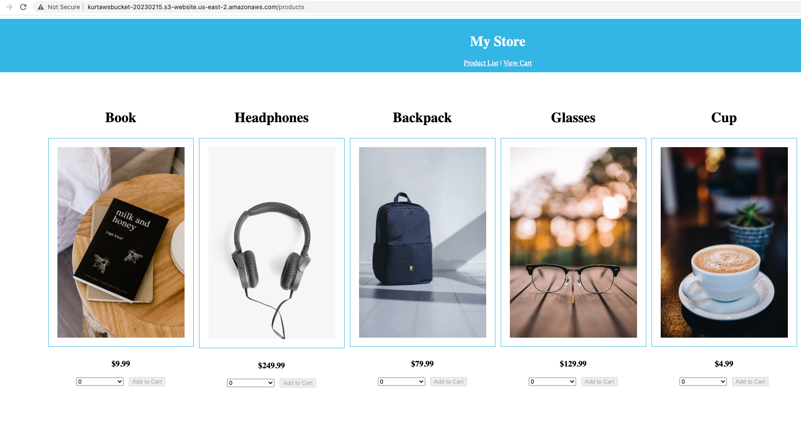

# Udacity-FullStackDeployment

This project is part of the Udacity Full Stack JavaScript Developer Nanodegree. The intent was to integrate my Frontend and Backend applications into a single CI/CD pipeline. I achieved this by adding my [Frontend repo](https://github.com/kprenger/Udacity-MyStore) and [Backend repo](https://github.com/kprenger/Udacity-StorefrontBackend) as git submodules to this Deployment repo. I then created a root package.json with scripts to call the various scripts in the submodules. This is all orchestrated via the .circleci/config.yml.

More information about my project (including required screenshots) can be found in the docs folder:
* [Application Dependencies](docs/ApplicationDependencies.md)
* [Infrastructure](docs/Infrastructure.md)
* [Pipeline](docs/Pipeline.md)

Specifics about the Frontend and Backend projects can be found in the READMEs of their respective repos linked in the first paragraph.

My [running web app](http://kurtawsbucket-20230215.s3-website.us-east-2.amazonaws.com/) will be active until after the instructor review is complete. After which, I will shut it down for cost savings purposes. A screenshot of the home page is below.

