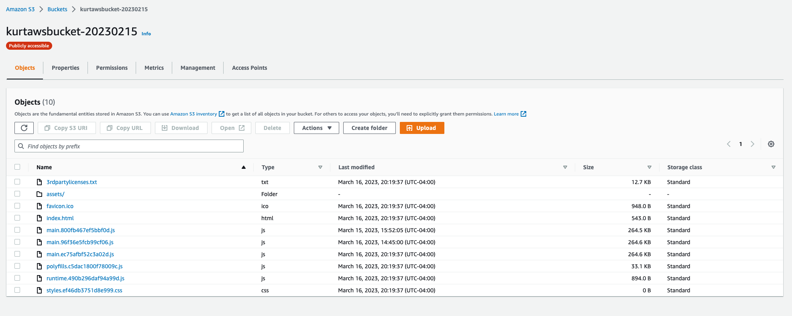

# Infrastructure

## Frontend

The Frontend is hosted as a static website in [Amazon S3](https://aws.amazon.com/s3/).

## Backend

The Backend API is hosted with [Elastic Beanstalk](https://aws.amazon.com/elasticbeanstalk/).

## Data

The Data is hosted in an [Amazon RDS](https://aws.amazon.com/rds/) instance.

